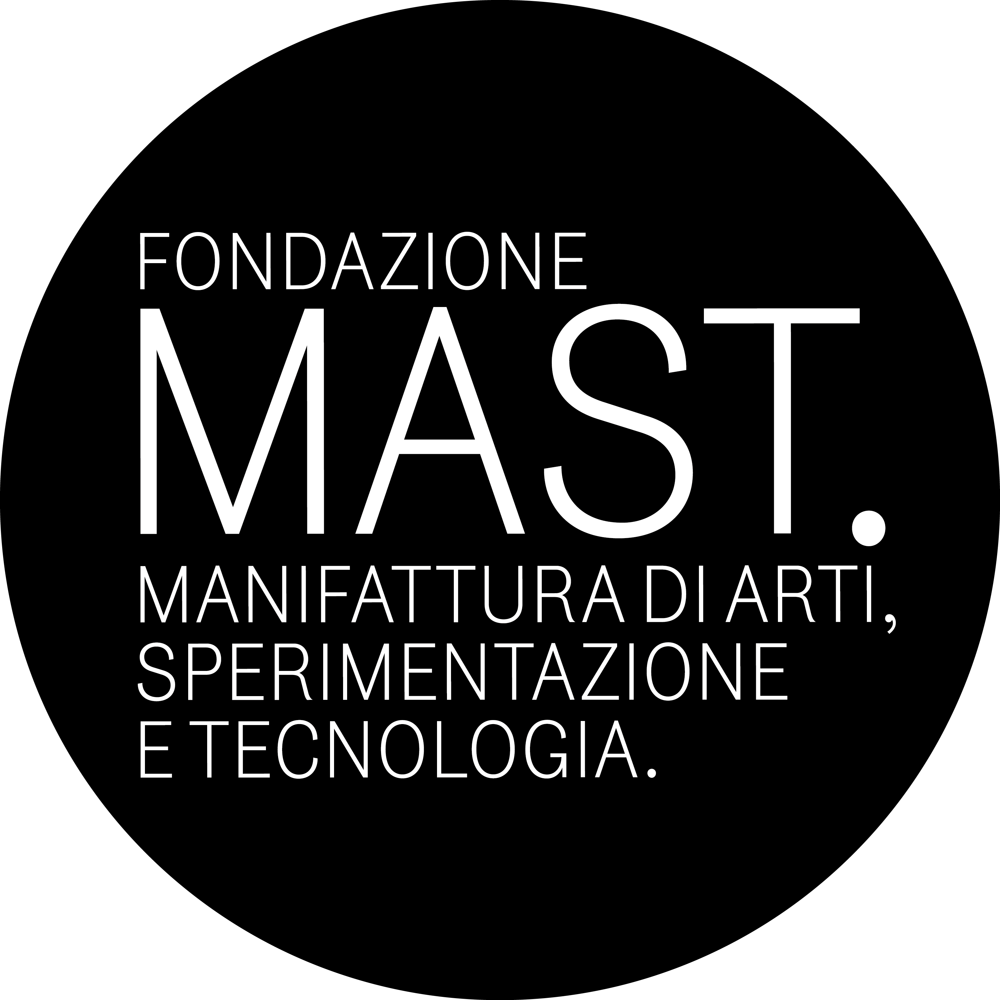

# Sensors library for the MAST summer school
## Add blocks to Mind+ for reading analog and digital sensors

More information available at the [summer school website](https://www.academy.mast.org/summer-school-2024/)

## Summary
Library to add the following blocks:
- read_sensor_data: take as input a list of sensor names and a reading time, and outputs a pandas dataframe containing the data
- save_sensor_data: take as input the pandas dataframe containing the data, and saves it locally

Compatible sensors include:
- 'pir': passive infrared sensor (digital reading, single channel)
- 'touch': capacitive touch sensor (digital reading, left and right channels)
- 'light': photoresistor (analog reading, left and right channels)
- 'ir': infrared distance sensor (analog reading, left and right channels)

Please note that the Bittle can only support up to two digital sensors and a single analog sensor at any given time. By default the data acquisition is performed every second for a total duration specified by the user. The dataframe includes a timestamp alongside the value for each read sensor, and is saved in one of the following directories depending on your operating system:
- Windows: C:\\Users\\{your user name}\\sensor_data
- MacOS: /Users/{your user name}/sensor_data
- Linux: /home/{your user name}/sensor_data

The user can specify the file name. If a file exists in the directory with that name, a new file is created with a progressive numbering in the format {filename}-1, {filename}-2, etc.

## How to install

Download and install [Mind+ Desktop app](https://mindplus.dfrobot.com).

Input the project URL: **https://github.com/PetoiCamp/Petoi_MindPlusLib** in the interface to import this library.
